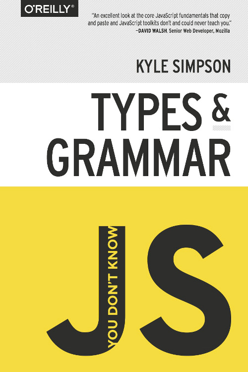

# You Don't Know JS: Types & Grammar <ins>**_Summary_**</ins> - 1st Edition

---

**[Purchase digital/print copy from O'Reilly](http://shop.oreilly.com/product/0636920033745.do)**

---

# <a href="https://github.com/getify/You-Dont-Know-JS/tree/1st-ed/types%20%26%20grammar">Book repo</a>

---

> [!CAUTION]
> This resource will be most useful if you have <i>already completed</i> the <a href="https://github.com/getify/You-Dont-Know-JS">original series</a>.
> In case you haven't, I strongly encourage you to try them first and use this repo as a refresher afterward.

---

 

- [Chapter 1: Types - Summary](ch1-summary.md)
- [Chapter 2: Values - Summary](ch2-summary.md)
- [Chapter 3: Natives - Summary](ch3-summary.md)
- [Chapter 4: Coercion - Summary](ch4-summary.md)
- [Chapter 5: Grammar - Summary](ch5-summary.md)
- [Appendix A: Mixed Environment JavaScript - Summary](apA-summary.md)
